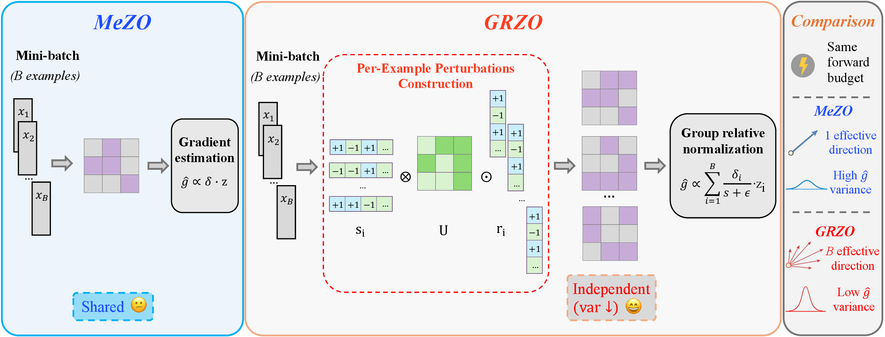
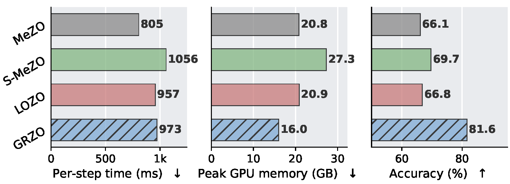
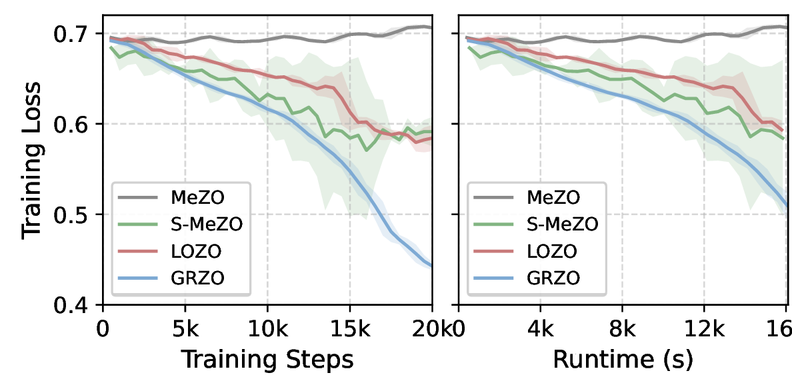
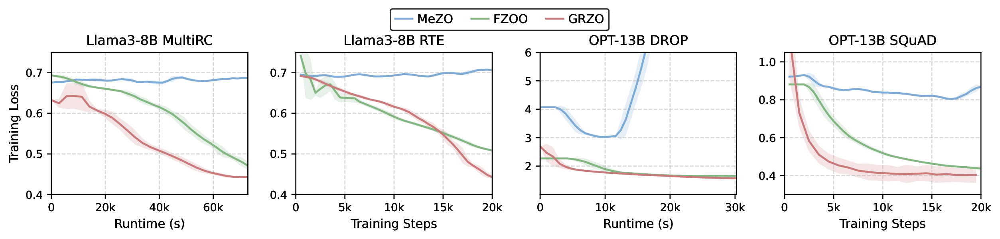
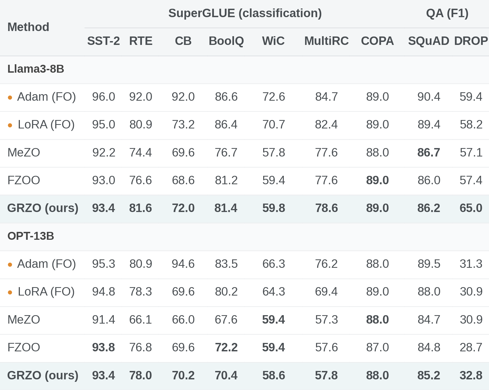
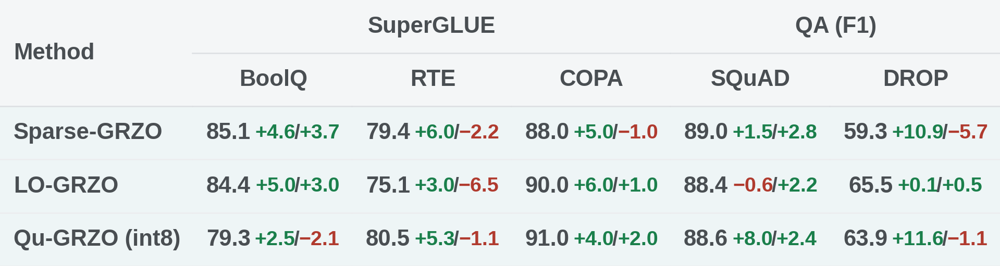
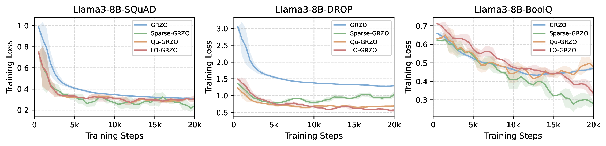
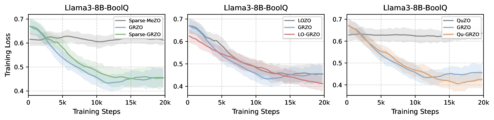
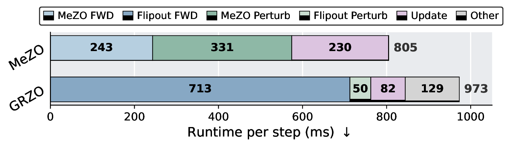
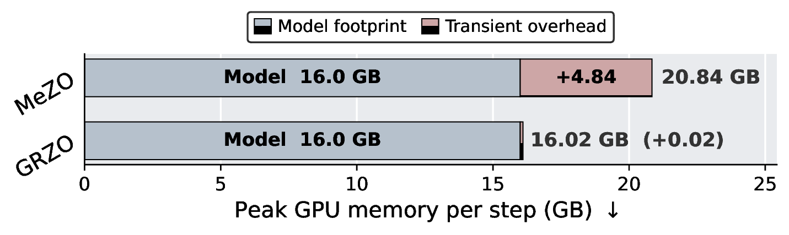

<h1 align="center">GRZO: Group-Relative Zeroth-Order Optimization for Large Language Model Fine-Tuning</h1>

<p align="center"><b>Findings of EMNLP 2026</b></p>

<p align="center">
Liyan Tan, Yequan Zhao, Yifan Yang, Ruijie Zhang, Xinling Yu, Zheng Zhang<br>
University of California, Santa Barbara
</p>

<p align="center">
<a href="https://arxiv.org/abs/2606.02857">arXiv</a> &nbsp;·&nbsp;
<a href="https://arxiv.org/pdf/2606.02857">PDF</a> &nbsp;·&nbsp;
<a href="https://liyantan111.github.io/papers/grzo/">Project page</a>
</p>

Zeroth-order fine-tuning trains LLMs with forward passes only, at inference-level memory,
but a single perturbation shared by the whole mini-batch makes its gradient estimate too
noisy. GRZO gives every example its own pseudo-independent perturbation and combines the
per-example losses with group-relative normalization, so one step yields B gradient
directions instead of one, at the same forward cost. On Llama3-8B it beats MeZO by +3.0
average accuracy at 0.5% above the forward-only memory floor, and dropped into sparse,
low-rank and quantized ZO variants it lifts them by +4.9 on average.

<p align="center"></p>
<sub>MeZO (left) shares one perturbation across the mini-batch: one gradient direction per
step. GRZO (right) builds per-example perturbations and applies group-relative
normalization: B directions per step, much lower variance, same forward budget.</sub>

## How it works

For a linear layer $W \in \mathbb{R}^{d_{out}\times d_{in}}$ and a batch of $B$ examples,
GRZO draws one shared base noise $U \sim \mathcal{N}(0, I)$ and per-example Rademacher
sign vectors $r_i \in \{\pm1\}^{d_{out}}$, $s_i \in \{\pm1\}^{d_{in}}$. Example $i$ sees
the perturbation $\Delta_i = U \odot (r_i s_i^{\top})$. A forward hook adds
$\sigma\, r_i \odot \big(U (s_i \odot x_i)\big)$ to the output of example $i$, so one
batched forward evaluates all $B$ perturbed models without materializing $B$ weight
copies. Two forwards ($\pm\sigma$) give per-example losses $\ell_i^{\pm}$, and

$$\delta_i = \tfrac{1}{2}\,(\ell_i^{+} - \ell_i^{-}), \qquad
a_i = \frac{\delta_i}{\mathrm{std}_j(\delta_j) + \varepsilon}, \qquad
\hat g_W = \frac{1}{2\sigma B}\sum_i a_i \Delta_i
         = \frac{U \odot \big(R^{\top}\mathrm{diag}(a)\,S\big)}{2\sigma B}.$$

The update $W \leftarrow W - \eta\,\hat g_W$ costs one $d_{out}\times B\times d_{in}$
matmul per layer; $U$ is regenerated from a seed and never stored. Norm layers use
per-example $\pm1$ vectors and embeddings receive sparse row updates for the tokens in the
batch. Under data parallelism the seed of $U$ is broadcast, the signs are per-rank, the
losses are all-gathered so the advantage is computed over the global batch, and only the
small response matrix $R^{\top}\mathrm{diag}(a)S$ is all-reduced.

## Results

<p align="center">


</p>
<sub>RTE, Llama3-8B. Left: highest accuracy at inference-level peak memory, for a 23%
per-step time premium over MeZO. Right: fastest convergence in both steps and wall-clock time.</sub>

<p align="center"></p>
<sub>Training loss on Llama3-8B (RTE, MultiRC) and OPT-13B (SQuAD, DROP) against steps and
wall-clock time: GRZO reaches any given loss level sooner on the clock.</sub>

<p align="center"></p>
<sub>Main results. Orange bullets mark first-order methods (full backpropagation memory);
the best ZO number per task is in bold.</sub>

<p align="center"></p>
<sub>GRZO as a drop-in replacement for the MeZO core inside Sparse-MeZO, LOZO and QuZO
(Llama3-8B). Each cell: accuracy, change vs. the paired baseline / change vs. vanilla GRZO.</sub>

<p align="center"></p>
<sub>GRZO and its sparse, low-rank and quantized variants on Llama3-8B.</sub>

<p align="center"></p>
<sub>Each variant with its original MeZO core versus the same variant with the GRZO core
(Llama3-8B BoolQ).</sub>

<p align="center">


</p>
<sub>Where the per-step premium comes from (Llama3-8B RTE, 4×A100-40GB): one hooked
forward replaces MeZO's three full-parameter perturb / restore passes, and peak memory
stays at the model footprint.</sub>

## Code

Built on the [MeZO](https://github.com/princeton-nlp/MeZO) pipeline (`MeZO/large_models/`);
GRZO itself is `optimizers/flipout.py` (single-GPU and DDP steps, plus the sparse,
low-rank and quantized variants).

```bash
git clone https://github.com/LiyanTan111/GRZO-public.git && cd GRZO-public
pip install -r requirements.txt                     # Python 3.12, torch 2.11, transformers 4.46.3

export MODEL_PATH=/path/to/Meta-Llama-3-8B          # or an HF model id with HF_TOKEN set
bash scripts/run_llama.sh                           # GRZO on RTE, 4 GPUs, paper defaults
TASK=BoolQ OPTIMIZER=grzo_sparse LR=1e-7 bash scripts/run_llama.sh
NPROC=1 PER_DEVICE_BATCH=16 bash scripts/run_llama.sh
```

Tasks: `SST2 RTE CB BoolQ WSC WIC MultiRC Copa ReCoRD SQuAD DROP` (downloaded from the
Hugging Face Hub). Every setting is an environment variable documented at the top of
`scripts/run_llama.sh`; extra `run.py` flags pass through `EXTRA="..."`.

| Paper | `--zo_optimizer` | Flags |
|---|---|---|
| GRZO | `flipout` | `--estimation_side two_norm --zo_eps 1e-3` |
| Sparse-GRZO | `grzo_sparse` | `--sparse_ratio 0.25 --sparse_rule small` |
| LO-GRZO | `grzo_lozo_strict` | `--lozo_rank 8 --lozo_step_interval 50` |
| Qu-GRZO | `grzo_quzo` | `--quant_bits 8` (`--quzo_weight_bits 4` for weight quantization) |
| MeZO / Sparse-MeZO / LOZO / QuZO / FZOO | `mezo` / `mezo_sparse` / `mezo_lozo` / `mezo_quzo` / `fzoo` | same flags as the matching GRZO variant |

`bash scripts/profile.sh` measures per-step time and peak memory of every optimizer
(`GRZO_PROFILE_OUT=<file>.json` turns the instrumentation on for any run) and
`python scripts/summarize_profile.py profiling` tabulates the result.

## Citation

```bibtex
@inproceedings{tan2026grzo,
  title     = {GRZO: Group-Relative Zeroth-Order Optimization for Large Language Model Fine-Tuning},
  author    = {Tan, Liyan and Zhao, Yequan and Yang, Yifan and Zhang, Ruijie and Yu, Xinling and Zhang, Zheng},
  booktitle = {Findings of the Association for Computational Linguistics: EMNLP 2026},
  year      = {2026}
}
```

Built on [MeZO](https://github.com/princeton-nlp/MeZO) (MIT license, `MeZO/LICENSE`); the
baseline variants follow [LOZO](https://github.com/optsuite/LOZO),
[Sparse-MeZO](https://github.com/NUS-HPC-AI-Lab/SparseMeZO), [QuZO](https://github.com/lloo099/QuZO)
and [FZOO](https://arxiv.org/abs/2506.09034).
